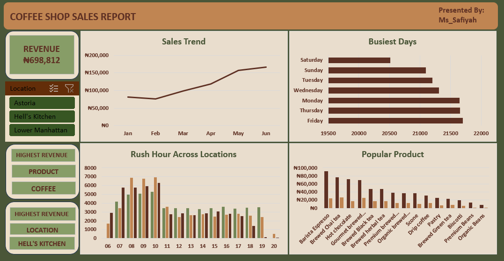
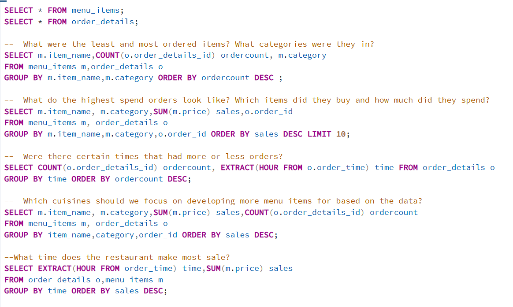
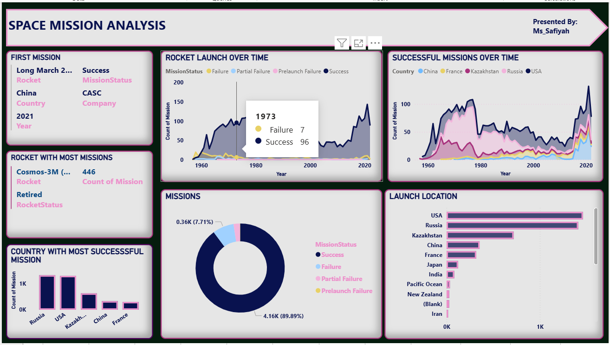

<!--Section 1: Introduce your self-->
# **ABOUT ME**

Hello! I'm Abiala Safiyah, an aspiring Data Analyst driven by the challenge of turning raw, fragmented data into clear business strategies. With a background in analyzing retail, hospitality, and global industry datasets, I specialize in identifying patterns that help businesses grow and operate more efficiently.

<!--Mention your top/relevant skills here - core and soft skills-->
## **SKILLS**
### Data Cleaning and Analysis

Using SQL, Excel, and Power BI, I have successfully executed projects that solve real-world business problems

- Extracting data using complex SQL queries (Joins, Aggregations, Subqueries).
- Cleaning & Analyzing trends in Excel to find the "Why" behind the numbers.
- Visualizing findings in Power BI to make insights accessible to stakeholders.

<!--Section 2: List 3-4 key projects-->
## **MY PROJECTS**

**A glimpse of some of the projects I have worked on.**

### ☕ [Coffee Shop Sales Analysis]( https://safiyah-abiala.github.io/Coffee-Shop-Sales-Portfolio/)
**Tool: Excel**

Analyzed 6 months of retail data to identify a 104% revenue growth trend. Optimized store operations by identifying peak transaction hours and top revenue-generating products.

### 🍽 [Restaurant Orders Project]( https://safiyah-abiala.github.io/Restaurant-orders-data-analysis-using-SQL/)
**Tool: SQL**

Conducted Exploratory Data Analysis (EDA) on restaurant menu and order data. Used advanced SQL aggregations and time-series extraction to identify high-value customer segments and recommend menu optimization strategies.

### 🚀 [Space Mission Global Trends]( https://safiyah-abiala.github.io/Space-mission-global-trend/)
**Tool: Power BI**

Designed an interactive dashboard tracking global space exploration from 1957 to the present. Focused on mission success rates, cost-effectiveness of launch vehicles, and the evolution of the commercial space race.

## CONTACT DETAILS

*Let’s connect and see how we can make a difference together!*
<table>
  <tbody>
    <tr>
      <td>📧</td>
      <td><a href="mailto:safiyahabiala@gmail.com">safiyahabiala@gmail.com</a></td>
    </tr>
    <tr>
      <td>📞</td>
      <td>(234) 815-205-8555</td>
    </tr>
    <tr>
      <td>📍</td>
      <td>Ibadan, Nigeria</td>
    </tr>
    <tr>
      <td>⬇️</td>
      <td><a href="Safiyah_Abiala_Data_Analyst_CV.pdf">Download my CV</a></td>
    </tr>
    <tr>
      <td>🌐</td>
      <td><a href="https://ng.linkedin.com/in/safiyah-abiala">My LinkedIn Profile</a></td>
    </tr>
  </tbody>
</table>
